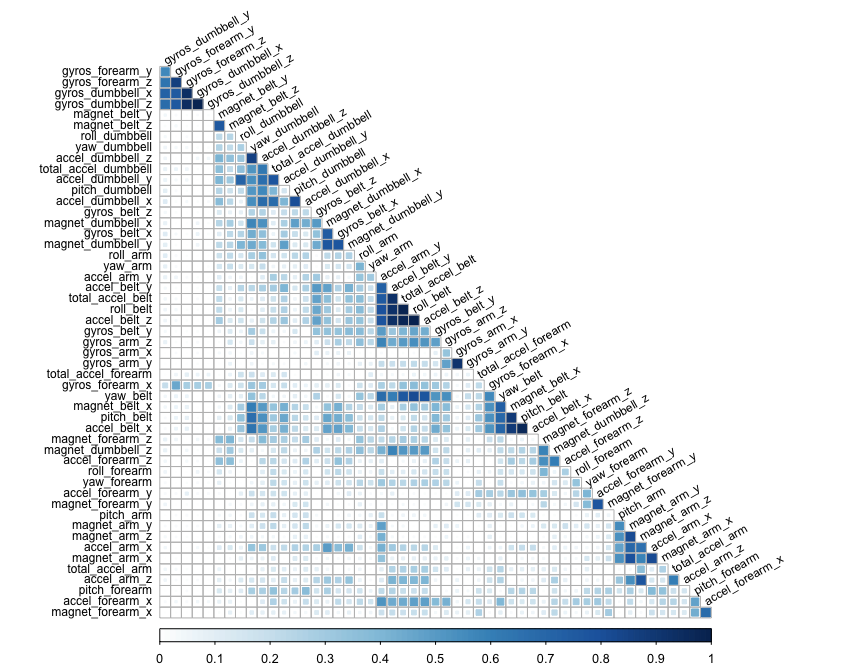
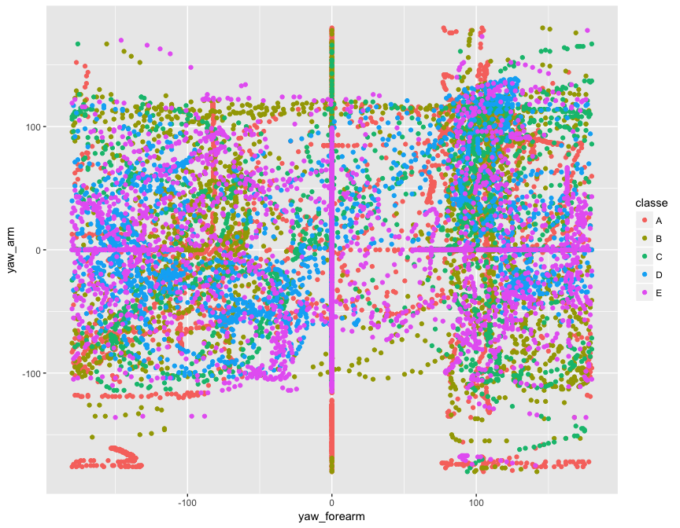

# Practical Machine Learning Final Project
Javier A. Rodón  
29.09.2017  


# Synopsis
The final project of the Practical Machine Learning course involves the construction of a predictive model and its application to a data set to obtain the answers to the final quiz.
The model is constructed based on the Weight Lifting Exercises (WLE) dataset provided by Velloso et al. (2013), which contains information on the execution of a dumbbell exercise performed in different ways.
After exploring the data we selected 52 predictors to train the model. We trained 4 different classification algorithms, with "Random Forest" yielding the best results. In the end we obtain a model with a 99.41$\,\%$ accuracy on the test dataset, which predicted $100\,\%$ of the quiz results.

# Preparation
## Nature of the data
The data consist on information from accelerometers on the belt, forearm, arm, and dumbell of 6 participants. They were asked to perform barbell lifts correctly and incorrectly in 5 different ways. The goal is to predict the manner in which they did the exercise. This is the "classe" variable in the training set.

## Obtaining the data
The original dataset, as well as information on its contents, can be obtained from http://web.archive.org/web/20161224072740/http:/groupware.les.inf.puc-rio.br/har. It has been processed for this project by the course instructors and the resulting datasets, to be used in this project, are available at https://d396qusza40orc.cloudfront.net/predmachlearn/pml-training.csv and https://d396qusza40orc.cloudfront.net/predmachlearn/pml-testing.csv.

We begin by setting up the work enviroment:

```r
## Load the required libraries
libraries <- c("caret","corrplot","parallel","doParallel")
lapply(libraries, library, character.only = TRUE)
options(digits = 2)
## Set up working directory
work.dir <- "Course8Week4Project"
if (!dir.exists(paste("..", work.dir, sep = "/"))) dir.create(work.dir)
if (is.null(getwd())) setwd(work.dir)
```

Then we download and load the data:

```r
## Download the data
file.name <- c("pml-training.csv","pml-testing.csv")
data.url <- c("~/data_science/R_Programming/Course8Week4Project/pml-training.csv",
              "~/data_science/R_Programming/Course8Week4Project/pml-testing.csv")
for (i in 1:2) {
      if (!file.exists(file.name[i])) download.file(data.url[i])
}
## Load the data
train.Data <- read.csv(file.name[1], na.strings = c("","NA","#DIV/0!"))
test.Data <- read.csv(file.name[2], na.strings = c("","NA","#DIV/0!"))
```

The first attempt at loading the data resulted on several columns marked as "factor" or "character" when they should have been "numeric". A quick exploration with `str()` and `summary()` showed that this was due to the occurrence of several "#DIV/0!" entries in the data file. Therefore the loading call with `read.csv()` was modified accordingly as shown before.

## Data exploration
We perform a customary examination of the data:

```r
## Data exploration
dim(test.Data); dim(train.Data)
```

```
## [1]  20 160
```

```
## [1] 19622   160
```

```r
names(train.Data[which(names(test.Data)!=names(train.Data))]); names(test.Data[which(names(test.Data)!=names(train.Data))])  # Differing names
```

```
## [1] "classe"
```

```
## [1] "problem_id"
```

We see that there are 160 potential predictors.

```r
str(train.Data) ; str(test.Data)
summary(train.Data) ; summary(test.Data) # Shows many NA
```

The output of the last 4 commands is hidden due to its lenght, but it shows that there are many columns full of NAs.

```r
sum(apply(test.Data,2,function(x) mean(is.na(x)) > 0.5)) # Useless variables
```

```
## [1] 100
```

This shows that there in fact 100 columns with at least half the content being NAs. This is checked on the test dataset since there is no point to use variables in the model that we know do not appear in the test dataset.
We also see from the `str()` call that there are variables that cannot be considered predictors, since they are entirely circumstancial and not affecting the outcome. Those are the following:

```r
names(test.Data[,c(1:6)])
```

```
## [1] "X"                    "user_name"            "raw_timestamp_part_1"
## [4] "raw_timestamp_part_2" "cvtd_timestamp"       "new_window"
```

The next step is to get rid of those useless variables.

## Cleaning the data
We begin by eliminating the columns with more than $50\,\%$ of NAs, then the variables with near-zero variance, and finally the circumstantial variables:

```r
## Eliminate columns with too many NAs
NA.Cols <- apply(test.Data,2,function(x) mean(is.na(x))) > 0.5
train.Data <- train.Data[,!NA.Cols]
test.Data <- test.Data[,!NA.Cols]
## Eliminate columns with near-zero variance
NZV.Cols <- nearZeroVar(train.Data, foreach = T)
train.Data <- train.Data[,-NZV.Cols]
test.Data <- test.Data[,-NZV.Cols]
## Eliminate circumstantial variables.
train.Data <- train.Data[,-c(1:6)]
test.Data <- test.Data[,-c(1:6)]
```

After this cleaning, the remaining predictors are 52.

# Building the model
## Splitting the data
Once the datasets were cleaned we constructed our training and testing datasets, assigning $75\%$ of the observations to the training dataset and the remaining $25\%$ being left for testing purposes:

```r
## Split the data
set.seed(1780)
in.Train <- createDataPartition(train.Data$classe, p = 0.75, list = F)
split.Train.Data <- train.Data[in.Train,]
split.Test.Data <- train.Data[-in.Train,]
```

## Predictor selection
To choose which predictors to use to build the model, we first checked the correlation matrix of the predictors:

```r
## Explore the variables
## Correlation matrix
cor.M <- cor(split.Train.Data[,-53]) 
corrplot(abs(cor.M),method = "square", 
         order = "hclust", type = "lower", diag = F,
         tl.col = "black", tl.cex = 0.75, tl.srt = 30,
         cl.lim = c(0,1), cl.cex = 0.8, cl.ratio = 0.1)
```



The figure above shows that there are just a few predictors that are highly correlated. They could potentially be combined by performing a Principal Components analysis, however the gain would not be much and therefore it is not performed.

Further exploration by plotting the predictors showed no obvious distinction of the outcome. Therefore, for brevity only one of said plots is shown here.

```r
qplot(yaw_forearm, yaw_arm, data = split.Train.Data, color = classe)
```



In conclusion, we decided to proceed with all the available predictors.

## Algorithm training
We chose four different popular classifiction algorithms: Random Forest, Classification Trees, Stochastic Gradient Boosting, and Conditional Inference Trees.

For the training we used a 10-Fold cross-validation resampling of the data, and the computation was parallelized:

```r
## Create the models
### Parallelize
cluster <- makeCluster(detectCores() - 1) # Leave 1 core for OS
registerDoParallel(cluster)
### Fit models
CV.control <- trainControl(method = "cv", number = 10, allowParallel = T, verboseIter = T)

model.Fit.RF <- train(classe ~ ., data = split.Train.Data, 
                      method = "rf", trControl = CV.control)
```

```
## Aggregating results
## Selecting tuning parameters
## Fitting mtry = 2 on full training set
```

```r
model.Fit.CART <- train(classe ~ ., data = split.Train.Data, 
                        method = "rpart", trControl = CV.control)
```

```
## Aggregating results
## Selecting tuning parameters
## Fitting cp = 0.0329 on full training set
```

```r
model.Fit.Boosted <- train(classe ~ ., data = split.Train.Data, 
                           method = "gbm", trControl = CV.control)
```

```
## Aggregating results
## Selecting tuning parameters
## Fitting n.trees = 150, interaction.depth = 3, shrinkage = 0.1, n.minobsinnode = 10 on full training set
## Iter   TrainDeviance   ValidDeviance   StepSize   Improve
##      1        1.6094             nan     0.1000    0.2359
##      2        1.4600             nan     0.1000    0.1546
##      3        1.3602             nan     0.1000    0.1243
##      4        1.2800             nan     0.1000    0.1002
##      5        1.2173             nan     0.1000    0.0914
##      6        1.1599             nan     0.1000    0.0812
##      7        1.1085             nan     0.1000    0.0645
##      8        1.0677             nan     0.1000    0.0567
##      9        1.0313             nan     0.1000    0.0536
##     10        0.9986             nan     0.1000    0.0565
##     20        0.7632             nan     0.1000    0.0287
##     40        0.5392             nan     0.1000    0.0106
##     60        0.4100             nan     0.1000    0.0060
##     80        0.3298             nan     0.1000    0.0054
##    100        0.2739             nan     0.1000    0.0055
##    120        0.2280             nan     0.1000    0.0032
##    140        0.1955             nan     0.1000    0.0012
##    150        0.1817             nan     0.1000    0.0019
```

```r
model.Fit.CondTree <- train(classe ~ ., data = split.Train.Data, 
                            method = "ctree", trControl = CV.control)
```

```
## Aggregating results
## Selecting tuning parameters
## Fitting mincriterion = 0.5 on full training set
```

```r
### Stop parallelization
stopCluster(cluster)
registerDoSEQ()
```

# Results
We applied the resulting models to the test dataset to obtain the expected accuracies and out-of-sample errors. The confusion matrices show the expected performance of the different algorithms.

```r
### Model results
pred.RF <- predict(model.Fit.RF,split.Test.Data)
con.M.RF <- confusionMatrix(split.Test.Data$classe,pred.RF)
model.Fit.RF ; con.M.RF$table ; con.M.RF$overall["Accuracy"]
```

```
## Random Forest 
## 
## 14718 samples
##    52 predictor
##     5 classes: 'A', 'B', 'C', 'D', 'E' 
## 
## No pre-processing
## Resampling: Cross-Validated (10 fold) 
## Summary of sample sizes: 13246, 13246, 13247, 13246, 13247, 13247, ... 
## Resampling results across tuning parameters:
## 
##   mtry  Accuracy  Kappa
##    2    0.99      0.99 
##   27    0.99      0.99 
##   52    0.99      0.98 
## 
## Accuracy was used to select the optimal model using  the largest value.
## The final value used for the model was mtry = 2.
```

```
##           Reference
## Prediction    A    B    C    D    E
##          A 1395    0    0    0    0
##          B    4  942    3    0    0
##          C    0    5  850    0    0
##          D    0    0   17  786    1
##          E    0    0    0    0  901
```

```
## Accuracy 
##     0.99
```

```r
pred.CART <- predict(model.Fit.CART,split.Test.Data)
con.M.CART <- confusionMatrix(split.Test.Data$classe,pred.CART)
model.Fit.CART ; con.M.CART$table ; con.M.CART$overall["Accuracy"]
```

```
## CART 
## 
## 14718 samples
##    52 predictor
##     5 classes: 'A', 'B', 'C', 'D', 'E' 
## 
## No pre-processing
## Resampling: Cross-Validated (10 fold) 
## Summary of sample sizes: 13247, 13245, 13246, 13247, 13244, 13247, ... 
## Resampling results across tuning parameters:
## 
##   cp     Accuracy  Kappa
##   0.033  0.51      0.36 
##   0.059  0.40      0.19 
##   0.116  0.32      0.06 
## 
## Accuracy was used to select the optimal model using  the largest value.
## The final value used for the model was cp = 0.033.
```

```
##           Reference
## Prediction    A    B    C    D    E
##          A 1265   32   91    0    7
##          B  369  370  210    0    0
##          C  378   40  437    0    0
##          D  331  157  316    0    0
##          E  127  135  237    0  402
```

```
## Accuracy 
##      0.5
```

```r
pred.Boosted <- predict(model.Fit.Boosted,split.Test.Data)
con.M.Boosted <- confusionMatrix(split.Test.Data$classe,pred.Boosted)
model.Fit.Boosted ; con.M.Boosted$table ; con.M.Boosted$overall["Accuracy"]
```

```
## Stochastic Gradient Boosting 
## 
## 14718 samples
##    52 predictor
##     5 classes: 'A', 'B', 'C', 'D', 'E' 
## 
## No pre-processing
## Resampling: Cross-Validated (10 fold) 
## Summary of sample sizes: 13245, 13247, 13247, 13245, 13245, 13245, ... 
## Resampling results across tuning parameters:
## 
##   interaction.depth  n.trees  Accuracy  Kappa
##   1                   50      0.75      0.68 
##   1                  100      0.82      0.77 
##   1                  150      0.85      0.81 
##   2                   50      0.86      0.82 
##   2                  100      0.91      0.88 
##   2                  150      0.93      0.91 
##   3                   50      0.90      0.87 
##   3                  100      0.94      0.92 
##   3                  150      0.96      0.95 
## 
## Tuning parameter 'shrinkage' was held constant at a value of 0.1
## 
## Tuning parameter 'n.minobsinnode' was held constant at a value of 10
## Accuracy was used to select the optimal model using  the largest value.
## The final values used for the model were n.trees = 150,
##  interaction.depth = 3, shrinkage = 0.1 and n.minobsinnode = 10.
```

```
##           Reference
## Prediction    A    B    C    D    E
##          A 1371   13    7    4    0
##          B   23  894   27    3    2
##          C    0   29  817    7    2
##          D    0    4   25  773    2
##          E    2    7   12    7  873
```

```
## Accuracy 
##     0.96
```

```r
pred.CondTree <- predict(model.Fit.CondTree,split.Test.Data)
con.M.CondTree <- confusionMatrix(split.Test.Data$classe,pred.CondTree)
model.Fit.CondTree ; con.M.CondTree$table ; con.M.CondTree$overall["Accuracy"]
```

```
## Conditional Inference Tree 
## 
## 14718 samples
##    52 predictor
##     5 classes: 'A', 'B', 'C', 'D', 'E' 
## 
## No pre-processing
## Resampling: Cross-Validated (10 fold) 
## Summary of sample sizes: 13246, 13246, 13247, 13247, 13247, 13247, ... 
## Resampling results across tuning parameters:
## 
##   mincriterion  Accuracy  Kappa
##   0.01          0.88      0.85 
##   0.50          0.89      0.85 
##   0.99          0.88      0.85 
## 
## Accuracy was used to select the optimal model using  the largest value.
## The final value used for the model was mincriterion = 0.5.
```

```
##           Reference
## Prediction    A    B    C    D    E
##          A 1326   33   11   17    8
##          B   60  792   46   19   32
##          C   17   34  737   49   18
##          D   30   22   34  702   16
##          E    4   39   34   19  805
```

```
## Accuracy 
##     0.89
```

We see that the Random Forest algorithm is the one that performs the best, with an accuracy of 99.39$\,\%$ or an *out-of-sample error* of 0.61$\,\%$. The Classification Trees was the worst, being no better than a coin flip.

# Conclusion
We applied the Random Forest model to the dataset containing the data for the quiz results. The answer we obtained were all correct, scoring $100\,\%$ in the quiz.

```r
## Obtain quiz results
quiz.Res <- predict(model.Fit.RF,test.Data)
quiz.Res
```

```
##  [1] B A B A A E D B A A B C B A E E A B B B
## Levels: A B C D E
```


